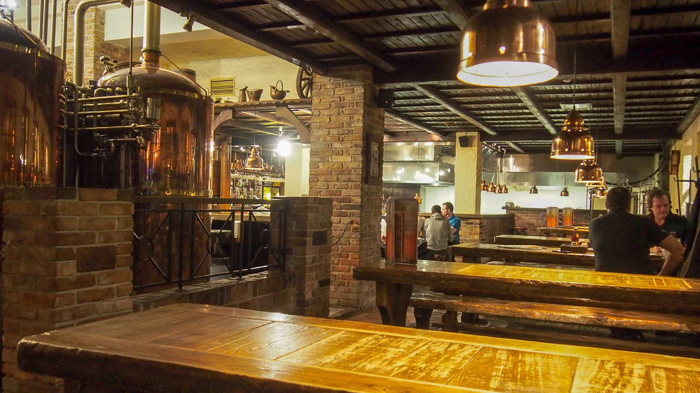

一般知識
---

# そもそもエストニアってどんな国？
エストニアはフィンランドの南、ロシアの西側から陸続きの場所に位置する北欧の国。バルト三国の中で一番小さい国です。

国土は九州よりも一回り大きい程度。人口は約130万人で、日本で言うと奈良県や青森県と同じぐらいです。
そのため、人口密度は北海道よりも更に低く、首都タリンの主要部ですら東京とは比較できないほどに人が少ない場所でした。

この写真は、今回の訪問で一番混雑しているときに撮影した旧市街の広場です。旧市街はタリンの中でも観光で栄える地域ですが、その旧市街でもあまり混雑しないことからも、ゆったりとした街だなと感じました。

また気候は年間通して比較的寒く、最も寒い時は-20度まで下がる日もあります。今回の訪問は3月下旬から約二週間でしたが、吹雪く日も何日かありました。また、朝は暖かくても昼から吹雪いたり、天気も変わりやすい印象を受けました。

## エストニアとIT
IT関連ではSkypeを輩出した国として有名です。会社自体はルクセンブルクで始まりましたが、開発はエストニアのタリンで行われました。
SkypeがeBayに売却されたことで当時の創業メンバーや開発に携わっていた人は売却益を得ました。

資金を得たメンバーたちは新たにスタートアップを始めたり、投資家となることでIT産業において新たな波を起こしています。そのため、アメリカでペイパルを創業して売却後様々な会社を創業したペイパルマフィアにまねて、Skypeマフィアと呼ばれています。

Skypeマフィア達が設立したそれぞれの会社が、時価総額10億ドルを超える規模の大企業に育っていたり、自動運転などの新たなテクノロジーでイノベーションを起こしているため、優秀なスタートアップを続々と輩出している国として注目を集めています。

また、国が提供する多くの公共サービスがデジタル化されていることから、未来の国の姿をイメージさせる電子国家としても注目されています。

## エストニアの歴史
|年月 | 略史 |
|:-- | -- |
|1219年|デンマーク人が進出し、タリン市を築く。|
|1346年|ドイツ騎士団が進出し、領有。|
|1629年|スウェーデン領となる。|
|1721年|北方戦争の結果ロシア領となる。|
|1918年|独立を宣言。|
|1920年|ソ連と平和条約を締結。|
|1940年|ソ連に併合。|
|1991年8月20日|エストニア最高会議が独立回復に関する決定を採択。|
|1991年9月6日|ソ連国家評議会がバルト三共和国の国家独立に関する決定を採択。|
|2004年3月|NATO加盟|
|2004年5月|EU加盟|
|2010年12月|OECD加盟|
|2011年1月|ユーロ導入|
*出典: [エストニア共和国 基礎データ](http://www.mofa.go.jp/mofaj/area/estonia/data.html)*

エストニアは100年前にロシアから独立して建国されました。2018年が独立100周年のため、街中が記念祝賀ムードで至る所に100周年記念のロゴを見かけます。

### ところどころ見かけるソ連の面影
エストニアは100年前の建国後もソ連にその独立を脅かされていました。1940年にはバルト諸国占領にてソ連に占領され、1991年のソ連崩壊まではソ連の属国になっていました。

今でも当時の影響を垣間見ることが出来ます。タリンの中心部に位置するviru hotelは日本でいう帝国ホテルのような大きい、町の中心に位置するホテルですが、ソ連統治時代には諜報組織であるKGBの秘密基地がありました。現在も当時の基地はそのまま残っており、博物館になっています。

また、カトリック中心の町中に周りと雰囲気が違う、ロシア正教会の教会、アレクサンドル・ネフスキー大聖堂が今でも残っています。過去、教会の移設運動なども起きたそうで、現地に住んでいる方の心境は複雑なのかもしれません。

今もなおロシアの脅威を感じることがあります。例えば、2007年にはエストニアは大規模なサイバー攻撃に遭いました。これは、当時エストニア政府が第二次大戦でのソ連軍の勝利を記念した銅像を首都タリンの中心部から郊外に移したことが発端と言われています。
ロシア国内でこの移設に反発する運動が起き、多くのハッカーがエストニアの攻撃に参加しました。ロシア政府は国民の関与を認めておりませんが、このことが発端となり、エストニアはサイバー攻撃の対策を強化することになります。

また、今後物理的に占領されることにも対策を打っています。その一つが国のシステムの電子化です。国のシステムをオンライン化しておくことで、万が一国が占領されたとしてもデータ自体はオンラインに存続することができ、国を取り戻したときにいつでも復帰させることができます。そのことから電子国家と呼ばれるようになりました。

電子国家に関する詳細は別の章で更に詳しく解説します。

# エストニアはどんな食事なの？
伝統的な食事はヘラジカのスープであるエルクスープや、北欧諸国でおなじみのライ麦で作られた黒パンなどがあります。一般的に食されるものには特別なものは無く、町の中心部にあるレストランに何箇所か入りましたが所謂イタリアンやフレンチのような食事が多かったです。

一方で、ちらほらと見かけたのが寿司屋でした。寿司はエストニアでも人気らしく、独自の進化を遂げています。例えば、あるお店で食べたのが白身魚で作った巻きずしを天ぷらにしたもの。意外にもあっさりしていて中々美味しいです。

また、米の代わりにもち麦のようなものが使われている寿司もありました。周辺国でサーモンが取れるためか、寿司にもサーモンやイクラなどがよく使われていました。スーパーなどの町中でもサーモンはよく見かけます。

# どんなお酒があるの？
よく飲まれるものは、普通にビールやワインのようです。また、お店でワインリストを見てもエストニア産のワインはあまり見かけなく、フランスやイタリア産のものが多かったです。

ビールは国産のSakuというブランドのものが人気のようで、日本のスーパードライを更にライトにした水のような飲み口のビールです。

タリン市内にはいくつかブルワリーを併設しているレストランもあり、ビールは比較的よく飲まれてると思いました。

# 物価や景気はどうなの？
エストニアはヨーロッパの中でも物価が安い国です。スーパーで売っているものの価格を比較すると、全体的に日本の7割程度の価格で購入できます。

以下は、エストニア発の移住支援ツールのスタートアップ"Teleport"で検索できる、エストニア タリンの物価一覧です。

ビールが一杯$1.6、リンゴやパンなどの食品は日本よりも半額程度、移動関連ではタクシーが日本の半額以下。一方で外食はランチで$10程度と、日本と同じか少し高めです。

国民の平均給与は低く、日本が平均年収420万円である一方、エストニア国民の平均年収は約170万円でした。  
*出典:[Average monthly gross wages (salaries) - Statistics Estonia](http://www.stat.ee/stat-average-monthly-gross-wages-salaries)*

しかしIT系の会社だけは例外で、今回アポイントを取ったあるスタートアップでは一般的なエンジニアの給与が年収500万円程度とのことでした。求人サイトを見てもIT系は年収が高いです。

  
*出典:[Software Engineer Salaries in Tallinn, Estonia Area](https://www.glassdoor.com/Salaries/tallinn-software-engineer-salary-SRCH_IL.0,7_IM1385_KO8,25.htm)*

# 休日の過ごし方は？
基本的には日本人と変わらないです。日本と違うのは、仕事帰りで同僚と一緒に飲みに行く文化があまりない点です。仕事中は仕事に集中し終わったら家庭に集中するという感じで、メリハリがあるのをよしとする文化があるようです。

ちなみに新宿や渋谷のような超大都市的な、クラブや飲み屋、ショッピングもできてアミューズメント施設もあるような、遊び場が存在しません。そのため、そういう楽しみ方をしたい人にとっては生活が退屈になりそうだなと感じました。

# エストニアでノマド生活はできる？
*Supporter's question*

結論から言うと、リモートワーカーであればエストニアは非常に仕事がし易い環境なんじゃないかなと思います。

冬の時期は非常に寒いですが、その分殆どの施設で暖房施設が整っています。家の中に居て寒さを感じることは殆どありませんでした。また、多くのカフェや公共施設でフリーWiFiが飛んでいます。パスワードすらかかっていないところが多いです。

驚いたのがコンセントの提供率の高さで、10箇所程度カフェに入りましたが殆どの場所でコンセントが各席に用意されています。もちろん、自由に使えました。日本と同じように、カフェでPCを開いて作業している人も見かけます。

こんなスーパーのちょっとしたイートインコーナーにもコンセントが用意されている程、どこでも電気もWiFiもありました。

また、仮にWiFiが無い場所でもプリペイドSIMが非常に安いため、通信量もあまりかかりません。例えば私が買ったSUPERという通信会社のSIMカードは、SIMカード本体の料金と10ギガバイト分の通信料で合計たったの9ユーロでした。もちろん4Gのため、WiFiがなくてもオンラインミーティングなども快適にできます。

前述の通り、生活コストもヨーロッパの中では比較的安いため夏の暑い時期にエストニアで三ヶ月程ノマド生活、というのは非常にアリなんじゃないかなと思いました。

後述しますが、Digital NOMAD VISAというノマドワーカー向けのビザも今後用意される方針で、リモートワーカーはこれからももっと集まると思います。
