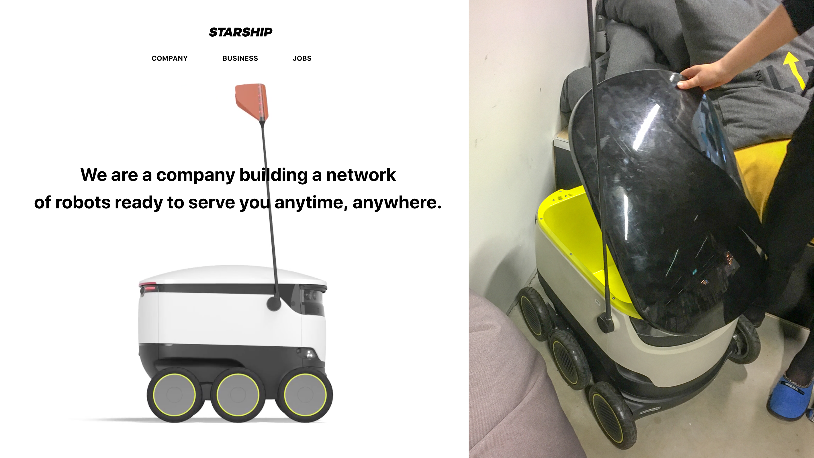
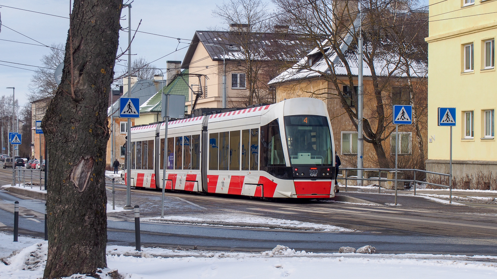
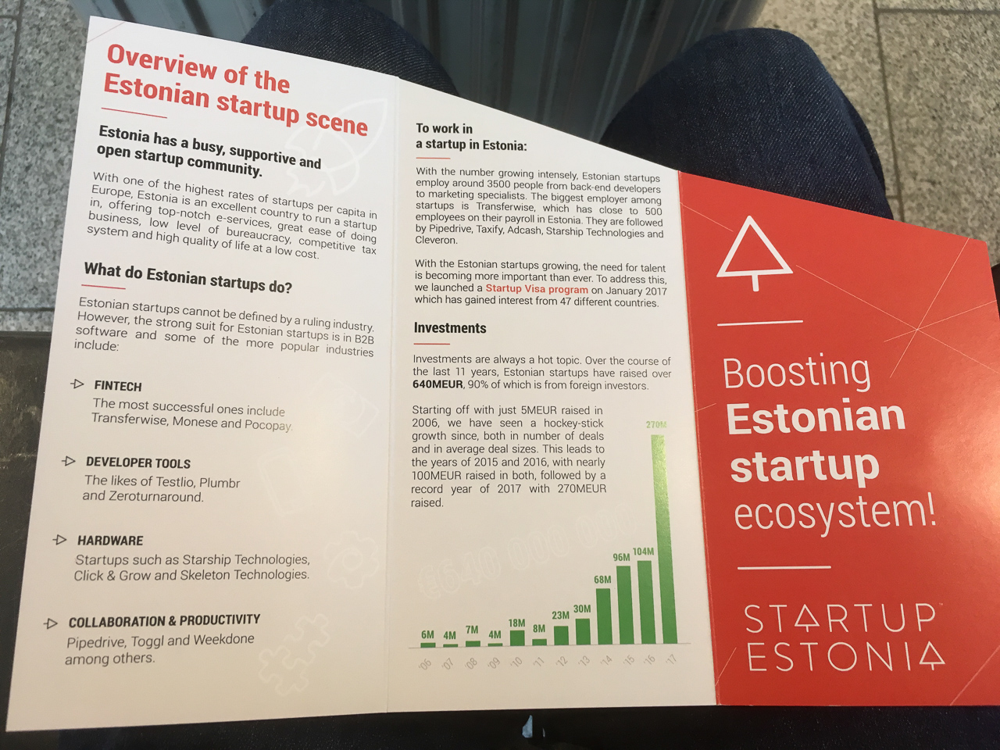

エストニアのスタートアップ環境
---

# どういうスタートアップが多いの？
スタートアップが参入している業種については特段傾向は見られませんでしたが、心なしかオンラインで完結する事業が多かった印象を受けています。Skypeマフィアが投資して上手く立ち上がっている会社を見ても、国際送金のTransferWise、中小企業向けのCRMであるpipedriveなどはツール系ビジネスです。

一方で法律などの議論がし易い環境からか、自動運転の技術を使った小型配送ロボットを開発しているStarship Technologyや、
タクシー配車アプリではtaxifyというサービスなど、各国のプレイヤーが法律が壁になって苦戦している事業もそこそこ進んでいる印象です。

今回アポイントを取った全てのスタートアップが、ターゲットの市場してグローバルか少なくともEU全体を見ていました。
エストニア国内のみを対象にするとマーケットが小さすぎるために必然的にグローバル・ビジネスを考えることになると、どのスタートアップ経営者も言っています。

## StartupEstonia
エストニアのスタートアップ情報は、ベンチャーキャピタルのKredexがエストニア政府とともに運営している[StartupEstonia](http://www.startupestonia.ee/)によくまとまっています。

このレポートを書いている時点で、464件ものスタートアップがStartupEstoniaのWebサイトに掲載されています。

StartupEstoniaの担当者によると、政府も事業者もエストニアから新たな産業をどう産むかを真剣に考えているため、自動運転や配車アプリのような事業も積極的に議論を行えていると言っていました。政府にとっても、エストニア発となる未来のデファクトスタンダードになるビジネスを作り出したいそうです。
そのため、産業全体でどのような未来を描くべきかを考えていて、それに合わせて法律を含めた国の制度を検討しているそうです。

# スタートアップはどんな環境？
1周目をeBayにExitして成功を収めたSkype、2周目をユニコーンとなったTransferwiseとして、今エストニアでは3周目の成功例となるスタートアップをみんなで作ろうとしているな、という印象を持ちました。

スタートアップに必要な人、金、場所の三点が非常に良いバランスで存在する場所だとも思います。

## 人
エストニアでは小学校からプログラミング教育が行われていたりリーダーシップ教育が行われています。なんと、一部の学校ではBitcoinのアプリ制作まで教えることもあるそうです。前述したStartupEstoniaの担当者によると、教育の成果か、ある大学でとったアンケートでは50%を超える人が起業家になりたいと答えたそうです。

人を雇う上で重要な人材も充実しています。首都タリンにはタリン工科大学という優秀なエンジニアが多数集まる大学もあるため、スタートアップで必要な優秀な人材がいます。一方で最近はそれでもエンジニアを中心に人が足りなくなっているらしいですが、エストニア政府の支援としてスタートアップに参画する人へ発行されるスタートアップビザや、外国から人を呼び込んで雇用した会社に払われる助成金の新設など、新たな対策を打ち始めています。

また、Skypeマフィアたちが集まるLIFT99やオンラインのコミュニティで相談できる起業家コミュニティも存在しています。

## 金
お金の面に関しても、前述したSkypeマフィアやエストニア政府も関わる半官半民ファンドなどがスタートアップへ投資を行っています。そのため、創業資金についても比較的集めやすい環境です。

また、創業間もないスタートアップの最初の壁は、成長サイクルに入るまでの産みの苦しみを超えるところです。事業の売上が上がり始めるまでは、なるべくバーンレート(出費)を少なく抑えて長生きする必要があります。

エストニアは他のEU諸国と比べるとおよそ7割程度と物価が安いため、スタートアップが生き延びるのに最適な土壌と言えます。

商談などに関しても、EU圏であればLCCも多数存在するため比較的安価に渡航できます。例えばイギリスやドイツのような国に商談で訪問する場合も、日本の東京大阪間の出張と近い感覚で営業ができ、低コストでグローバル・ビジネスが展開出来ます。

## 場所
そして、自然が多く人口密度も低い、静かで誘惑が少ないために仕事に集中できる環境を揃えているのがエストニアです。

スタートアップにとって重要なのは、共に働くメンバーが集まること、投資家が近くに居ること、そして仕事に集中できる環境であることだと思います。それを満たしていたために多くのスタートアップが集まったのがシリコンバレーです。

過去、シリコンバレーに滞在していたときにそのように感じましたが、今のエストニアは同じ雰囲気を感じます。

実際、そのような環境の結果、Skypeのあとの成功例となるTransferwiseやCRM大手のpipedriveなどのサービスが生まれました。

スタートアップにとって重要なのは、共に働くメンバーが集まること、投資家が近くに居ること、そして仕事に集中できる環境であることだと思います。それを満たしていたために多くのスタートアップが集まったのがシリコンバレーです。

# スタートアップはどういうチームが多いの？国籍や年齢は？
当初訪問するまでは色々な国の人が集まっているんだろうと思っていましたが、意外にもエストニア人が多かったです。

今回は7社のスタートアップのCEOに会いましたが、1社以外は全てエストニア人が代表でした。社員に関しても、10名以上いるようなチームであればイタリアやインドなどの国から来たというメンバーもいましたが、大半はエストニア人で構成されています。

人に恵まれているエストニアでもまだまだ人材は足りていなく、スタートアップで働くひとに発行されるStartupVisaを通じて海外の優秀な人材を採用するために様々な取り組みを試行錯誤している途中、という感じでした。

また、年齢に関しては創業者は大体が30代前半程度の方で、働いているメンバーも同年代程度でした。

# スタートアップはどこで資金調達しているの？
Skypeマフィアからのエンジェル投資のほか、それらの成功したスタートアップの創業者からなる[SuperAngel](https://superangel.io/)などのファンドから調達しているようです。また、[TeraVentures](https://tera.vc/)など政府と民間が共同運営するVCのもあります。

その他に世界中のスタートアップと同じように、シリコンバレーのYCombinatorのピッチコンテンストに出場して投資を得ているケースもありました。

# エストニアのスタートアップコミュニティの特徴は？
アイディエーションからメンタリング、投資までそれぞれが揃っているのが印象的でした。

アイディエーションに関しては、Garage48というハッカソンを定期的に行う非営利団体があります。同団体が運営するLIFT99では定期的に様々な分野のハッカソンイベントが開催されています。このGarage48自体、Skypeマフィアの一人であるMartin Villigが立ち上げた団体です。

また、メンタリングに関しては同じくSkypeマフィアや働いていたメンバーからなるSkype上のオンライングループなどがあり、ビジネスの相談などを行っているそうです。他にも、[EAS](https://eas.ee)という事業に対するメンタリングやファンディングのサポートを行う非営利団体もありました。

# 国がスタートアップに対して行っている支援は？
国をあげて特定のスタートアップのために具体的な支援をしているという事例は聞きませんでしたが、政府も関わる大型のスタートアップイベントLatitude59の開催やスタートアップ参加者向けのビザ、検討段階ではありますが外国から人を採用した際に助成金を出すことなどが行われているそうです。

## Latitude59
Latitude59は毎年5月頃に開催されるエストニアで最も大きなスタートアップイベントです。過去にはエストニアの首相をはじめ、taxifyやpipedriveなどエストニアを代表するスタートアップも参加し交流イベントなどを開いています。

また、2017年の回ではmisletoeの孫泰蔵氏や福岡市長の高島宗一郎氏も参加するなど、日本人にとっても注目のイベントです。

## Startup Visa
StartupVisaはスタートアップで働きたい外国人向けのビザ制度です。エストニアで会社を立ち上げたり、[国に指定されたスタートアップ](http://www.startupestonia.ee/visa/estonian-startups)で働く際に取得できます。エストニアはシェンゲン協定の区域内なので、このビザを取得することでヨーロッパ各国にアクセス可能になります。

ただし、エストニアで起業すれば簡単にエストニアのビザを取得でき、ヨーロッパに住めるというわけではありません。実際はスタートアップビザの申請は半分以上が却下されているそうです。ある程度は将来性が見込まれないと取得が難しいのは他国同様だそうです。

# AirbnbやUberなどのライドシェアは法律的に認められてる？
少なくとも、今回の滞在時はどちらのサービスも利用可能でした。

##  民泊(Airbnb)
日本では180日間しか貸し出せなかったり、管理業者の設置義務などの厳しいルールのもと展開されているAirbnbですが、エストニアでは特に厳しいルールはなく自由に部屋を貸し出せるようです。

ただし、エストニアのAirbnbにリスティングされている物件は、住んでいる家の空き部屋を貸すというよりは、ほとんどが簡易ホテルのようなものでした。一つはアパートの部屋貸しでキーボックスの開けて自分でチェックインする無人タイプ、もう一つは一部屋に二段ベッドが何台か置いてある、ドミトリータイプの安い宿タイプでした。

ちなみに、日本人が経営しているホステルもAirbnbに掲載されています。[旅の家](https://www.airbnb.jp/rooms/9271822)は7年ほど前にエストニアに移住した日本人が経営するホステルで、私が3泊した間もロシアやドイツ、イギリスなど様々な国の人が訪れていました。

更に驚いたのが、他の物件で部屋の管理をしている人とたまたまその物件で出会ったことです。どうやら、旧市街の中心部ではAirbnbの管理などの仕事があるようで、半分住み込みのような形で働いていました。

##  ライドシェア(Uberとtaxify)
いわゆるライドシェアアプリはUberと、エストニア発の配車アプリであるtaxifyが利用可能です。taxifyはSkypeマフィアの一人が創業しており、現在では北欧を中心に展開していす。

法律的には白タクは許可されておらず、日本の二種免許の取得が必要だったり、車両もタクシー事業としての登録が必要です。

しかし、日本と違いタクシー事業者の資格取得ハードルが非常に低く、簡単な申請と少額の手数料を支払うだけで運転手になれるそうでした。であれば、運転手として参入する人が大量に出てきそうですが、しかし、タクシー事業用の車両として登録すると、車の買い替え時に売却額が著しく下がるといったデメリットもあるそうで、現実はあまり運転手は人気がないようでした。

サンフランシスコでは流しのタクシーは殆ど見かけない程度に配車アプリが使われているようでしたが、エストニアでは普通にタクシーは走っているし、タクシー乗り場のようなところに車が溜まっている風景も見られました。

金額は物価のやすさも相まってか非常に安く、15分ほど乗って4ユーロ弱でした。現地に到着した最初の数日は移動のたびに使っていました。

一方で、街中の大体の主要箇所にはトラム(路面電車)が通っているため、現地生活に慣れるとタクシーよりも更に安いトラムを使う機会のほうが多かったです。

余談ですが、StartupEstoniaの代表になぜtaxifyが上手く参入できたのか話を伺ったところ、Uberはフランスなどで政府の規制やタクシー団体の抗議を無視していた一方、taxifyは当初からタクシー産業を巻き込む戦略を取っていたために対立することがなく、スムーズに導入できたそうです。

# スタートアップの給与、実際の勤務時間、チームの男女比は？
## 給与
給与はポジションによりますが日本の水準とほぼ同じようです。一方で、エンジニアは日本のスタートアップよりも比較的給与が良い会社もありそうです。例えば、ある資金調達を10億円単位で終えているスタートアップに聞いたところYoung engineerが月給40万円程度、フルスタックエンジニアで月給90万円程度とのことでした。

## 勤務時間
勤務時間もチームによってまちまちですが、幾つかのスタートアップチームやコワーキングスペースのスタッフにヒアリングしたところ朝9時から夕方6時で仕事を切り上げることが多いそうです。エストニアでは仕事とプライベートや家族をきっちり分ける、メリハリのついた働き方が良しとされているそうです。

## 男女比
どの会社も女性はあまり多くなく、20名程度の会社でも女性率は2割程度でした。フィンランドなどの福祉サービスが整っている国と違い、女性の支援という面はそこまで整備されていないようです。

ただし、特段低く扱われているということもなさそうです。女性が少ない理由を聞いてみたところ、単に男性の方が応募が多く来ることが理由と言っていました。

# エストニアでの起業で苦労する点は？
エストニアでの起業は、登記作業自体は世界一簡単に行えます。オンラインで住民向けのポータルサイトにアクセスし、必要項目を埋めるだけで最短18分程度で頭囲が行えるそうで、そのスピードがギネス記録にもなっているほどだそうです。

一方で、現地の起業家も言っていましたが、エストニアの人口が少ないために国内ビジネスや日本の古くからある会社のような営業モデル、力技で立ち上げるようなことは難しそうでした。

また、最近は世界中の例にもれずエンジニアに関しても不足しがちだそうで、人材採用の面でもまだまだ苦労することはありそうです。

とはいえそのような問題は世界中どこも抱えています。エストニアだから特段苦労する、という課題は特になさそうでした。

# エストニアならではの業務ツールなどはあるか？
基本的には日本と変わらず、ほとんどの会社がSlackとGSuiteを使って働いていました。一部、Skypeを使ってコミュニケーションを取っているというスタートアップもありました。

コワーキングスペースのスタッフは、勤怠管理ツールでエストニア発のtogglというサービスを使っていました。また、チャットツールは同じくエストニア発のFleepというSlackの代替アプリを使っている会社もありました。

# 紙ベースでの作業が必要など、デジタル化ができていない業務はあるか？
ほぼ全ての業務がデジタル化できている印象です。

実際、今回の滞在中に紙を使って仕事している会社は一度も見ませんでした。一部例外として、StartupEstoniaがエストニアのスタートアップ環境を紹介するパンフレットを配っていた程度です。

会社間の契約書も基本的にはオンラインで済ませるとのこと。また、商談も基本的にはビデオチャットで行うのが一般的と仰っていました。一部の会社ではFacebookかLinkedInだけでやり取りをしていて、名刺すら持ってない人もいたのには驚きました。
