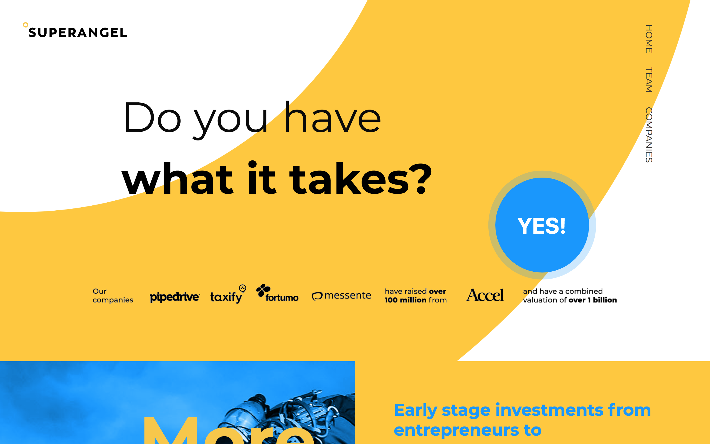
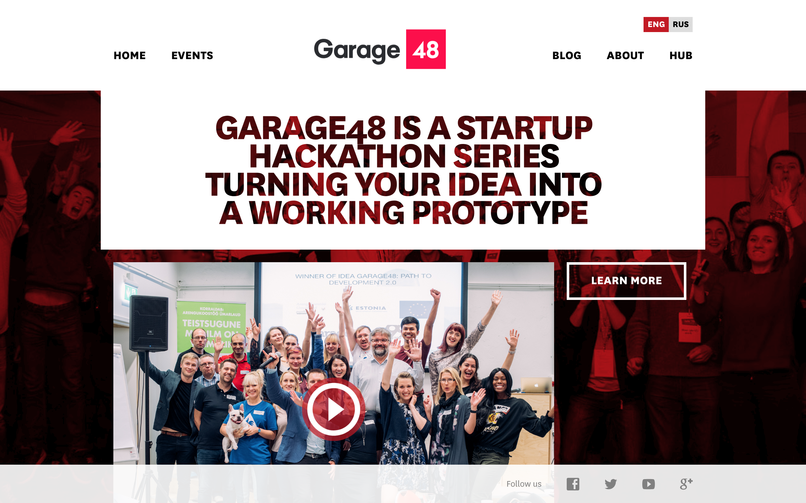

エストニアのスタートアップ環境
---

# どういうスタートアップが多いの？
スタートアップが参入している業種については特段傾向は見られませんでしたが、心なしかオンラインで完結する事業が多かった印象を受けています。Skypeマフィアが投資して上手く立ち上がっている会社を見ても、国際送金のTransferWise、中小企業向けのCRMであるpipedriveなどはツール系ビジネスです。

一方で法律などの議論がし易い環境からか、自動運転の技術を使った小型配送ロボットを開発しているStarship Technologyや、
タクシー配車アプリではtaxifyというサービスなど、各国のプレイヤーが法律が壁になって苦戦している事業もそこそこ進んでいる印象です。

[starshipの写真]
[taxify]

今回アポイントを取った全てのスタートアップが、ターゲットの市場してグローバルか少なくともEU全体を見ていました。
エストニア国内のみを対象にするとマーケットが小さすぎるために必然的にグローバル・ビジネスを考えることになると、どのスタートアップ経営者も言っています。

## StartupEstonia
エストニアのスタートアップ情報は、ベンチャーキャピタルのKredexがエストニア政府とともに運営しているによくまとまっています。
このレポートを書いている時点で、サイトのStartupDatabaseに掲載されているスタートアップだけでも464件あるそうです。

StartupEstoniaの担当者によると、政府も事業者もエストニアから新たな産業をどう産むかを真剣に考えているため、自動運転や配車アプリのような事業も積極的に議論を行えていると言っていました。
未来のデファクトスタンダードになるエストニア発のビジネスを考える必要があるため、産業全体でどのような未来を描くべきかを考えていて、それに合わせて法律を含めた国の制度を検討しているそうです。

# スタートアップはどんな環境？
1周目をeBayにExitして成功を収めたSkype、2周目をユニコーンとなったTransferwiseとして、今エストニアでは3周目の成功例となるスタートアップをみんなで作ろうとしているな、という印象を持ちました。

スタートアップに必要な人、金、場所の三点が非常に良いバランスで存在する場所だとも思います。

**人**  
エストニアでは小学校からプログラミング教育が行われていたりリーダーシップ教育が行われています。なんと、一部の学校ではBitcoinのアプリ制作まで教えることもあるそうです。前述したStartupEstoniaの担当者によると、教育の成果か、ある大学でとったアンケートでは50%を超える人が起業家になりたいと答えたそうです。

人を雇う上で重要な人材も充実しています。首都タリンにはタリン工科大学という優秀なエンジニアが多数集まる大学もあるため、スタートアップで必要な優秀な人材がいます。一方で最近はそれでもエンジニアを中心に人が足りなくなっているらしいですが、エストニア政府の支援としてスタートアップに参画する人へ発行されるスタートアップビザや、外国から人を呼び込んで雇用した会社に払われる助成金の新設など、新たな対策を打ち始めています。

また、Skypeマフィアたちが集まるLIFT99やオンラインのコミュニティで相談できる起業家コミュニティも存在しています。

**金**  
お金の面に関しても、前述したSkypeマフィアやエストニア政府も関わる半官半民ファンドなどがスタートアップへ投資を行っています。そのため、創業資金についても比較的集めやすい環境です。

また、創業間もないスタートアップの最初の壁は、成長サイクルに入るまでの産みの苦しみを超えるところです。事業の売上が上がり始めるまでは、なるべくバーンレート(出費)を少なく抑えて長生きする必要があります。

エストニアは他のEU諸国と比べるとおよそ7割程度と物価が安いため、スタートアップが生き延びるのに最適な土壌と言えます。

商談などに関しても、EU圏であればLCCも多数存在するため比較的安価に渡航できます。例えばイギリスやドイツのような国に商談で訪問する場合も、日本の東京大阪間の出張と近い感覚で営業ができ、低コストでグローバル・ビジネスが展開出来ます。

**場所**  
そして、自然が多く人口密度も低い、静かで誘惑が少ないために仕事に集中できる環境を揃えているのがエストニアです。

スタートアップにとって重要なのは、共に働くメンバーが集まること、投資家が近くに居ること、そして仕事に集中できる環境であることだと思います。それを満たしていたために多くのスタートアップが集まったのがシリコンバレーです。

過去、シリコンバレーに滞在していたときにそのように感じましたが、今のエストニアは同じ雰囲気を感じます。

実際、そのような環境の結果、Skypeのあとの成功例となるTransferwiseやCRM大手のpipedriveなどのサービスが生まれました。

スタートアップにとって重要なのは、共に働くメンバーが集まること、投資家が近くに居ること、そして仕事に集中できる環境であることだと思います。それを満たしていたために多くのスタートアップが集まったのがシリコンバレーです。

# スタートアップはどういうチームが多いの？国籍や年齢は？
当初訪問するまでは色々な国の人が集まっているんだろうと思っていましたが、意外にもエストニア人が多かったです。

今回は7社のスタートアップのCEOに会いましたが、1社以外は全てエストニア人が代表でした。社員に関しても、10名以上いるようなチームであればイタリアやインドなどの国から来たというメンバーもいましたが、大半はエストニア人で構成されています。

人に恵まれているエストニアでもまだまだ人材は足りていなく、スタートアップで働くひとに発行されるStartupVisaを通じて海外の優秀な人材を採用するために様々な取り組みを試行錯誤している途中、という感じでした。

また、年齢に関しては創業者は大体が30代前半程度の方で、働いているメンバーも同年代程度でした。

# スタートアップはどこで資金調達しているの？
Skypeマフィアからのエンジェル投資のほか、それらの成功したスタートアップの創業者からなる[SuperAngel](https://superangel.io/)などのファンドから調達しているようです。また、[TeraVentures](https://tera.vc/)など政府と民間が共同運営するVCのもあります。

その他に世界中のスタートアップと同じように、シリコンバレーのYCombinatorのピッチコンテンストに出場して投資を得ているケースもありました。

# エストニアのスタートアップコミュニティの特徴は？
アイディエーションからメンタリング、投資までそれぞれが揃っているのが印象的でした。

アイディエーションに関しては、Garage48というハッカソンを定期的に行う非営利団体があります。同団体が運営するLIFT99では定期的に様々な分野のハッカソンイベントが開催されています。このGarage48自体、Skypeマフィアの一人であるMartin Villigが立ち上げた団体です。

また、メンタリングに関しては同じくSkypeマフィアや働いていたメンバーからなるSkype上のオンライングループなどがあり、ビジネスの相談などを行っているそうです。他にも、[EAS](https://eas.ee)という事業に対するメンタリングやファンディングのサポートを行う非営利団体もありました。

# 国がスタートアップに対して行っている支援は？
**TODO: 要調査＆書き込み**
スタートアップビザ
ロビイングの支援:startup estonia
具体的な事例
人を採用したら助成金が出る制度(TODO: 裏付けとる)

# AirbnbやUberなどのライドシェアは法律的に認められてる？
少なくとも、今回の滞在時はどちらのサービスも利用可能でした。

##  民泊(Airbnb)
日本では180日間しか貸し出せない制限など、厳しいルールのもと展開されているAirbnbですが、エストニアでは特に厳しいルールはなく自由に部屋を貸し出せるそうです。

Airbnbにリスティングされている物件はほとんどが簡単なホテルのようなものでした。一つはアパートの
部屋貸しでキーボックスの開けて自分でチェックインする無人タイプ、もう一つは一部屋に二段ベッドが何台か置いてある、ドミトリータイプの安い宿タイプでした。

[泊まったホテルの物件写真を載せる]

ちなみに、日本人が経営しているホステルもAirbnbに掲載されています。旅の家(Tabinoya)は7年ほど前にエストニアに移住した日本人が経営するホステルで、私が3泊した間もロシアやドイツ、イギリスなど様々な国の人が訪れていました。

更に驚いたのが、他の物件で部屋の管理をしている人とたまたまその物件で出会ったことです。どうやら、旧市街の中心部ではAirbnbの管理などの仕事があるようで、半分住み込みのような形で働いていました。

##  ライドシェア(Uberとtaxify)
いわゆるライドシェアアプリはUberと、エストニア発の配車アプリであるtaxifyが利用可能です。taxifyはSkypeマフィアの一人が創業しており、現在では北欧を中心に展開していす。

法律的には白タクは許可されておらず、日本の二種免許の取得が必要だったり、車両もタクシー事業としての登録が必要です。

[Uberとtaxifyのロゴを見比べられるような写真]

しかし、日本と違いタクシー事業者の資格取得ハードルが非常に低く、簡単な申請と少額の手数料を支払うだけで運転手になれるそうでした。であれば、運転手として参入する人が大量に出てきそうですが、しかし、タクシー事業用の車両として登録すると、車の買い替え時に売却額が著しく下がるといったデメリットもあるそうで、現実はあまり運転手は人気がないようでした。

サンフランシスコでは流しのタクシーは殆ど見かけない程度に配車アプリが使われているようでしたが、エストニアでは普通にタクシーは走っているし、タクシー乗り場のようなところに車が溜まっている風景も見られました。

[タクシープール写真]

金額は物価のやすさも相まって非常に安く、15分ほど乗って4ユーロ弱でした。そのため、現地に到着した最初の数日は移動のたびに使っていました。一方で、街中の大体の主要箇所にはトラム(路面電車)が通っているため、現地生活に慣れるとタクシーよりも更に安いトラムを使う機会のほうが多かったです。
余談ですが、スタートアップと政府をつなぐ団体StartupEstoniaの代表になぜtaxifyが上手く参入できたのか話を伺ったところ、Uberはフランスなどで政府の規制やタクシー団体の抗議を無視していた一方、taxifyは当初からタクシー産業を巻き込む戦略を取っていたために対立することがなく、スムーズに導入できたそうです。

# 今一番熱いスタートアップはどこ？
Skypeマフィアの流れから、既に成功した会社と見られている会社があります。以下にその会社と規模をリストアップします。

[スタートアップ表を作る]
Transferwise
StarshipTechnology
pipedrive
Funderbeam
jobbatical
それぞれ時価総額は、 transferwiseが$1.6b、starship $114.67m、pipedrive $113.33m、funderbeam $14.76m

# スタートアップの給与、実際の勤務時間、チームの男女比は？
## 給与
給与はポジションによりますが日本の水準とほぼ同じようです。一方で、エンジニアは日本のスタートアップよりも比較的給与が良い会社もありそうです。例えば、ある資金調達を10億円単位で終えているスタートアップに聞いたところYoung engineerが月給40万円程度、フルスタックエンジニアで月給90万円程度とのことでした。

## 勤務時間
勤務時間もチームによってまちまちですが、幾つかのスタートアップチームやコワーキングスペースのスタッフにヒアリングしたところ朝9時から夕方6時で仕事を切り上げることが多いそうです。エストニアでは仕事とプライベートや家族をきっちり分ける、メリハリのついた働き方が良しとされているそうです。

## 男女比
どの会社も女性はあまり多くなく、20名程度の会社でも女性率は2割程度でした。フィンランドなどの福祉サービスが整っている国と違い、女性の支援という面はそこまで整備されていないようです。

ただし、特段低く扱われているということもなさそうです。女性が少ない理由を聞いてみたところ、単に男性の方が応募が多く来ることが理由と言っていました。

# エストニアに住むとしたらどのぐらい費用がかかる？
タリンで一番栄えている旧市街エリアにある、ワンルームの部屋で6万円程度とのことでした。(TODO: Teleport使って肉付けできないか調査。恐らく3万円程度の物件でもっと悪いのとか、もっと良い物件で同じ価格のものがある。)

電気代もあまりかさむことはないそうですが、冬の期間だけはかなり電気代が高くなるそうで、二人暮らしで月3万円を超えることもあるそうです。(出典: エストニアブログ)

外食に関しては、旧市街にあるレストランは基本的にそこまで安くなく、おおよそ15ユーロ程度は毎食かかりました。しかし、スーパーの食材は安いため移住した場合は自炊することで低コストで生きられるかと思います。

ちなみに、その国の物価の参考になるビックマックの単品価格は、ほとんど日本と同じ3.3ユーロでした。
[マクドナルド写真]

# エストニアでの起業で苦労する点は？
**TODO: 要調査＆書き込み**
会社を作ること自体は非常に簡単でオンラインだけで完結する
最短で18分で登記できるのはギネス記録にもなっているほど
一方でエストニアの人口は少ないので、国内ビジネスとか、営業モデルで力技でみたいなことはできなさそう

# エストニアならではの業務ツールなどはあるか？
※メール、チャットアプリ、スプレッドシート、タスク管理、、、等の業務ツールは、何を使っているか？(エンジニアやマーケターが、どんなツールを使って業務効率化を図っているかを知りたい。日本とのツール上の違いがあれば知りたいです。)(八巻さん)
基本的には日本と変わらず、ほとんどの会社がSlackとGSuiteを使って事業を運営していました。一部、Skypeを使ってコミュニケーションを取っているというスタートアップもありました。

コワーキングスペースのスタッフは、勤怠管理ツールでエストニア発のtogglというサービスを使っていました。また、チャットツールは同じくエストニア発のFleepというSlackの代替アプリを使っている会社もありました。

[Fleepのスクショ]

# 紙ベースでの作業が必要など、デジタル化ができていない業務はあるか？

※まだ業務ツールでは、デジタル化出来ていない業務領域(例えば、営業はオフラインでのやり取りがまだ残っている。や、書面でのやり取りが残っているなど)(八巻さん)

ほぼ全ての業務がデジタル化できている印象でした。今回の滞在中に紙を使って仕事している会社は一度も見ませんでした。一部例外として、StartupEstoniaがエストニアのスタートアップ環境を紹介するパンフレットをくれた程度です。

会社間の契約書も基本的にはオンラインで済ませるとのこと。また、商談も基本的にはビデオチャットで行うのが一般的と仰っていました。一部の会社ではFacebookかLinkedinだけでやり取りをしていて、名刺すら持ってない人もいたのには驚きました。
