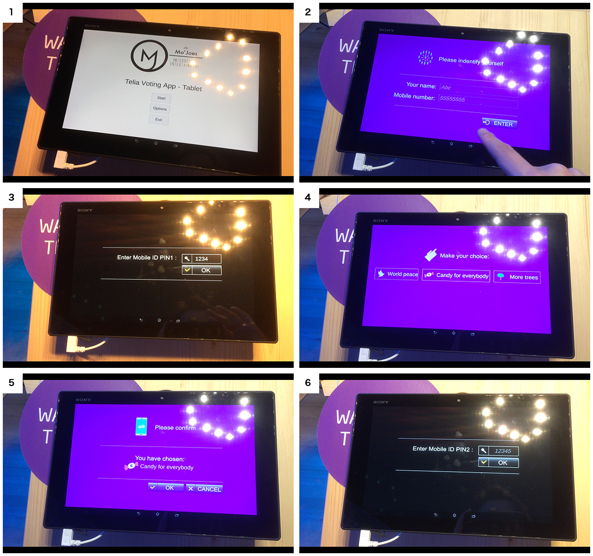

電子国家エストニア
---

# なぜ電子国家と言われているの？
国の様々なシステムがインターネット上からアクセスできるようになっていることが一番大きい理由です。例えば病院のカルテはオンラインで繋がっていて病院間をまたいで共有することができます。薬局でもカルテや過去の服薬歴を確認できるため、日本のようにお薬手帳を持ち歩かなくてもオンラインのデータを参考にして処方を検討することが出来ます。また、世界で唯一投票もオンラインで行える国でもあります。

公共サービスの99%はオンラインで完結すると言われており、できないことは結婚と離婚、不動産の売却のみです。その他にも、最近では国民のDNA情報を国のデータベースに保存する取り組みが検討されているなど、先進的な取り組みを行っていることも電子国家と言われる所以です。

# どういう仕組で実現しているの？
X-Roadという国民の情報が保管されている各データベースを統合して提供する独自のネットワークを用意することで、様々なサービスの電子化に成功しています。X-Roadで通信されるデータは全て暗号化されており、盗み取ることが出来ないようになっています。

この暗号を解除するために必要になるのが、国民全員に配られているeIDカードです。日本のマイナンバーカードに似ていますが、異なるのが記載されている情報自体は公開できる情報であることです。日本のマイナンバーカードは番号を知られないようにしないといけないなど取り扱いが大変ですが、eIDは気にする必要がないため気軽に取り扱えます。

eIDにはICチップが埋め込まれていて、これがX-Roadで手に入れた個人情報を閲覧するための鍵になっています。eIDを使って閲覧できる状態にしなければ政府の人でさえ情報にはアクセスできません。その為、各自が名実ともに自分の個人情報をコントロールできるようになっているのです。

# 滞在していて電子国家を感じることはある？
まず感じたのは決済周りが日本よりも圧倒的に便利だったことです。これは、エストニアだけでなくヨーロッパ諸国にもいえますが、殆どの場所でクレジットカードが使えます。そのため、今回二週間程滞在していましたがコインロッカーと有料トイレを除いて、一度も現金が必要になることはありませんでした。屋台ですらクレジットカード対応しているのには驚きました。

電車に乗る際、住民はSuicaような非接触カードはよく使っていますが、交通機関が用意しているスマホアプリ上でクレジットカード決済すればQRコードが発行されてチケットを買わずに乗車することもできるようになっていました。私のような観光客にとっては、オンラインで購入できるのは非常に安心です。

また今回は使いませんでしたが、駐車の際もオンラインの駐車システムでカード支払いすることで車が停められるなど、いたるところでIT化されているなと感じました。

# eResidencyって何？
エストニアは電子国家を実現するために、世界中の人に対して電子住民として公共サービスの一部を提供する制度をはじめました。それがe-Residencyです。

e-Residencyになることで、国民に発行されているe-IDカードと似たe-Residencyカードが発行されます。これを利用することで、エストニアに住んでいない外国の人でもオンラインでエストニアに会社を設立することが出来ます。EU圏にビジネス展開をする際の拠点としてその会社を利用できるため、その制度が注目されているのです。

また、e-Residencyカードを利用することで契約書などの電子署名を行うことも出来ます。

e-Residencyになるには、Webサイトからパスポートなどの必要書類と取得理由を送り取得申請を送る必要があります。承認されれば、約一ヶ月で大使館にカードが届きe-Residencyになることが出来ます。

# e-ID、e-Residencyは実際普及しているの？
当初、e-IDが発行された際は殆どが使われなかったそうです。しかし、ここ5年でe-IDを使ってできることが増えたため急速に利用率が上がっているそうです。

オンラインで利用できる公共サービスの殆どはe-IDを使った認証が必要になっているため、病院のカルテの取得や投票などの際にはe-IDは必ず利用するそうです。

また、銀行取引の際にもログインするためにe-IDが使われているそうです。他にも、e-IDを使うことで運転免許証情報が取得できるため免許証ではなくe-IDを携帯していたり、個人の納税もe-IDを使って行えるため、生活の要所要所で使っているようです。

一部のITに強い国民が使っているだけではなく、かなり多くの国民が実際に活用しているようです。今回訪問したエストニアの電子国家プロジェクトを広報する施設「e-Estonia Showroom」でも、その数字が発表されていました。

[eIDの利用率関連の数字を出しておく]

# 仮想通貨エストコインって何？
エストニアがユーロとは別にestCoinという独自の仮想通貨(暗号通貨)を発行すると報じられました。仮想通貨はまだ実用性が疑われる中で、政府主導で発行するため実用的な通貨として利用できることが期待され、一部仮想通貨界隈で話題になりました。

しかし、残念ながら発行については具体的なアクションは決められていなく、あくまでジャストアイデアな段階のようです。

元々の噂の出処は、e-Residencyを担当するチームが運営するブログにて仮想通貨estcoinのアイデアについて書いた記事で、仮にestcoinという仮想通貨を発行したとして買ってくれるか？という投げかけ程度のものです。
参考 : https://medium.com/e-residency-blog/were-planning-to-launch-estcoin-and-that-s-only-the-start-310aba7f3790

その為、具体的にこのプロジェクトを実行する方向にあるわけでもなく、あくまで噂レベルの話というのが実態のようです。

更に、仮想通貨に関する規制はEUに準拠する方針で、EUでは仮想通貨の新規発行(ICO)を規制する方向で議論されています。そのため、estcoinのような構想は今後規制されうる方向にあるとも言えます。

# エストニアではどんなSNSが使われているの？
エストニアでは日本と同じく、FacebookとInstagramが使われているようです。一方でTwitterを使っている人は殆どいないそうで、政治家や一部の技術者などの専門的な分野の情報を見るために使う程度だそうです。

仕事のつながりもプライベートもどちらもFacebook上で発信しているようで、LinkedInも使われていませんでした。また、メッセンジャーアプリはWhatsAppではなくFacebookメッセンジャーを使っているそうです。電話ツールとしてviberを使うという人も複数人いました。

興味深いのは、日本と同じくFacebook離れのようなことが起きてきたと言っていたことです。現地のスタートアップの経営者やコワーキングスペースのスタッフに話を聞いたところ、Facebookへの投稿することに疲れたり、流れてくるフィードがつまらなく感じている雰囲気が出てきたと言っていました。ちなみに、LINEのようなクローズドなSNSは使われていないか聞いてみましたが、特にそういうものは存在していないそうです。

また、日本と同様にinstagramやYouTubeでのインフルエンサー・マーケティングも存在するそうで、特にメイク系やファッションモデルの分野で活躍している人が出てきているそうです。

# デジタルデバイド問題はないの？
高齢の方々に話が聞けたわけでは無いので実際のところは判断が難しいですが、なんとか助け合いながら利用しているそうです。

あるスタートアップの経営者に聞いたところ、エストニアは冬になると雪深くその中をかきわけて役所に行くよりも頑張ってパソコンを覚えた方が楽だから、高齢者も頑張ってIT慣れするようになった、と言っていました。

# エストニアはタックス・ヘイブンになるの？日本人が法人を作った際の税制面でのメリットは？
エストニアは所得税が一律20%、法人税も一律20%という税制を持っています。また、法人税に関しては配当時に課税される制度になっています。
そのため、内部留保したり自社の事業へ再投資すれば課税されないため、EU圏でビジネス展開を考えている方にとっては税制面で非常に大きなメリットがありそうです。

一方で、課税に関しては状況によって非常に異なるため一概には言えません。eResidencyを使ってエストニアに法人を作った場合、
エストニアが納税対象の地域になるため、前述の税制を元に税額が決まります。

しかしながら、価値を作った国に対して税金を支払うというのが税制の原則になっているため、日本で完結するビジネスを行う場合にはタックスヘイブンになることはなさそうです。

価値を作っているのがどの国なのか、というのは厳密には国内の税理士に確認した方が良いかと思いますが、[恒久的施設](https://www.nta.go.jp/taxes/shiraberu/taxanswer/gensen/2882.htm)などがその閾値になっているそうです。

どちらにせよ、エストニア政府やeResidencyのチームなどの話を聞く限り、エストニアをタックスヘイブンとしての国にするつもりはないようです。
むしろ、今後も適正に税制を変えて産業を生みやすい土壌づくりに力をかけていくはずなので、いずれにせよ中長期的にはタックスヘイブンとしてエストニアに拠点を作るのは得策ではなさそうです。

# エストニアでは税金はどうやって納めるの？確定申告は？
eIDやeResidencyを使うことでオンラインで税金を納めることができます。

# 日本とWebコミュニティで異なるポイントは何かある？
日本と違うポイントは、日本よりも単一のWebサイトが重要視されている点かと思います。

例えば飲食店に関して言えばエストニアにはYelp!や食べログのようなレビューサイトがありません。そのため、Googleビジネスなどが比較に使われるのですが、細かいメニューなどを見ようと思うとWebサイトを見ることになります。Webサイトをより簡単に作るためのスタートアップもありました(Weps)。

一方で、その他の点に関して大きな違いは感じませんでした。むしろ、エストニア自体が小さい国であるために、どこか大きな国の文化に統合されている印象です。日本のようにクローズドなSNSかつメッセンジャーアプリであるLINEが生まれたり、Twitterで独自の文化が生まれるのは、ある程度の人数規模があったり言語的な壁が大きいからなのかなと感じました。

# 電子化に伴って職を失う人はいなかったのか？
今回の調査で知る限りは、電子化といっても国の基幹システムをオンラインで連結する、というところが大きいため職をなくすような変化にはなっていないようです。

また税理士や会計士がいなくなった、とも言われていますが現時点でも存在はしているようです。

# 以下については追加調査中です！
- 電子化されたデータの売買が行われる事はありますか？
  - 今回聞いた限りでは売買を行っている話は見つかりませんでした。国が保有しているデータをもとにビジネスを動かしている事例などを追加調査しています。
- 国家や政府に対して不安に思うこと
  - 特段電子化周りにおいて、不安を持っているなどの話は聞きませんでした。この点についても、電子政府関連のチームに確認するなどで追加調査をしています。
