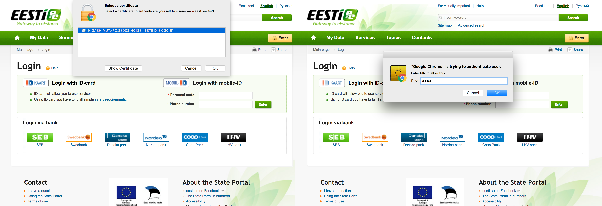
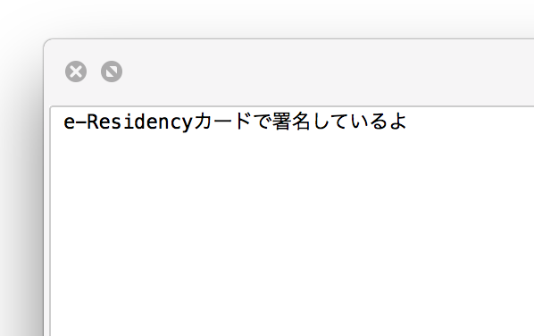

e-Residencyカードを使ってみた
---

# 使ってみた
カードリーダーにICカードを差し込んで、USBポートに接続します。


使い方に関してはポータルサイトが用意されています。キットにURLが記載されていました。(公開して良いものなのか判断できないので、気になる方は調べてみてください。)


サイトに記載のある通り、Webブラウザにカードを読み込むためのプラグインをインストールし、PCにも利用するためのアプリケーションをインストールします。

e-Residencyカードを使うことで、登記だけでなく銀行口座の登録/利用や@eesti.eeドメインのメールアドレスの利用など様々なサービスを使うことができます。

# Eesti.ee提供サービス
eesti.eeはエストニアが運営しているWebサイトです。オンラインで受けられるサービスへの入り口になっています。


サイトへのログインは、エストニア国民に配られるeIDかe-Residencyを使います。
カードを指した状態で、ログインボタンを押すとpin(暗証番号)の入力を求められるので、e-Residencyキットに入っていた番号を入力します。




ログインすると、ダッシュボードから様々なサービスにアクセスできます。


## eestiドメインのメールアドレスとURLの取得
国民やe-Residencyは@eesti.eeドメインでメールアドレスを使うことができます。
特段必要はないし、現地の方もあまり使っていないと聞いていますが設定しました。


それ以外にも、色々とできることはありそうですが、実際に利用できそうなものは登録情報の照会程度でした。

# eIDユーティリティと電子署名、暗号化アプリ
初期設定時に、PCにインストールしたアプリケーションも触ってみます。これらのアプリケーションが用意されていました。


* ID-card utility
  - IDカードに保存されているデータから情報を取得するツール。e-ResidencyカードのPIN変更などはこのアプリケーションから行う。
* DigiDoc3 Client
  - e-Reidencyの機能を使って、任意のファイルへの署名や暗号化を行うためのツール。
* TeRa
  - 署名を行ったファイルにタイムスタンプを付加するためのツール。(使い方がわからず、今回は使っていません)

## ID-card utility
カードを挿入して開くと、このような画面が表示されます。eesti.eeで設定したメールアドレスなどが表示されていました。e-Residencyの設定時に顔写真を入れましたが、Load Pictureをクリックしてもエラーが出るだけで画像は表示されませんでした。国民が持っているeIDの場合は、カードに写真も入っているので表示されるのかもしれません。


## DigiDoc3 Client
このアプリケーションで、任意のファイルに電子署名を含めたり暗号化することが可能です。


試しに、このようなテキストファイルを使って署名を入れてみましょう。



### 署名を追加
用意したテキストファイルをDigiDoc3に読み込ませます。


e-Residencyカードを元に署名を行うので、PINコードを入力すると、このように署名画面になります。会社名なども任意で追加できるようでした。

Signをクリックすると、bdocという拡張子のファイルが作られます。

### 中身を確認
生成されたファイル自体はバイナリ形式なので、そのままでは中身を見ることはできません。データを取り出す際にもDigiDoc3を利用します。

とはいえ、どのような中身になっているのかバイナリエディタで開いてみました。


暗号化するわけではないので当然ですが、入力したテキストがそのまま梱包されているのがわかります。

再び、Digidoc3を使ってオリジナルのファイルを取り出してみます。先程生成されたbdocのファイルをDigidoc3に読み込ませると、以下の画面になります。


他の方の署名を追加したり、元のファイルを取り出すことができます。

### 試しに改ざんしてみた
署名が実際に機能しているのか、改めてバイナリエディタでデータを書き換えて確認してみます。

分かりづらいですが、```e-Residency```を```E-residency```に書き換えてみました。


すると、Digidoc3では開けなくなっていました。


正しい検証方法かはわかりませんが、少なくともこのような改ざんを行うと署名が検証できなくなるようです。

### ファイルの暗号化
Digidoc3は、ファイルの暗号化もできます。e-Residencyで暗号化したデータは、指定した個人番号を持つカードで復号できます。逆に、カードが無ければ復号することは絶対にできなくなります。


このようなファイルを作ってみました。


Digidocで読み込ませます。


右下のAdd recipientをクリックすると、eIDやe-Residencyカードに書いてある個人番号を入力します。


個人番号自体は生年月日と性別などから構成されるため、機密情報ではなく公開できる番号です。暗号化したファイルを見ても良い人から個人番号を聞いておき、ここで入力することになります。

その後、Encryptボタンを押すと暗号化されます。

実際にファイルを開いてみると、中身が暗号化されて読めなくなっている事がわかります。


署名したファイルのときと同じく、再びDigiDocを使って復号します。読み込ませたら、特にPINの入力は必要なかったので誰が受け取れるかは開封の可否にかかわらず確認できそうです。


DecryptボタンをクリックするとPINを求められるので、入力すると元のファイルが抽出できます。


## まとめ
一通り使いましたが、e-Residency自体は何度も使うものではないなと思いました。というのも当然ですが、電子署名などオンラインで本人を証明するのがこの仕組になるわけですが、そのような本人証明のタイミング自体が少ないからです。

とは言え、署名や暗号化の仕組み自体は国のシステムだけでなく自由に使えるのが素晴らしいなと思いました。

仮にこの仕組が更に広まれば機密情報をやり取りする際にいちいちパスワードを設定する必要も無いですし、サイトのログインなどもこのカードがあれば十分です。

また、国民に発行されているeIDは契約している携帯のSIMカードで代用するmobileIDという仕組みもあるので、カードをPCに差し込む必要すらなくなります。

エストニアの国の様々な恩恵を受けること以上に、この仕組み単体でも非常に有用なものだなと思いました。