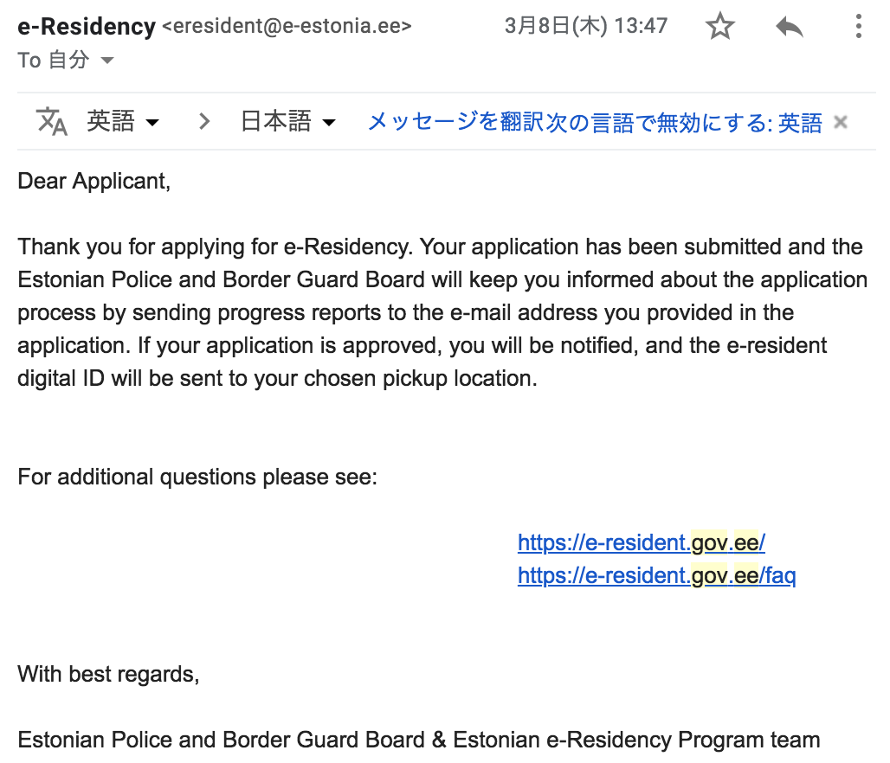

e-Residencyを取得してみた
---

# 必要なもの
- パスポートの写真(署名・顔写真が掲載されているページ)
- 100ユーロ(クレジットカード払い)
- 顔写真

# サイトから申請する
## 基本情報の入力
e-Residencyの[Webサイト](https://e-resident.gov.ee/)からオンラインで申請します。

氏名、生年月日、住所などの個人情報を入力します。後日e-Residencyカードなどを受け取る場所を指定できますが、現在国内で対応しているのは東京の大使館のみのようです。エストニアでは警察署などで受け取ることができるようです。

入力項目の中にSNSアカウントを求められるのが、エストニアらしいなと思いました。

## 申請理由の入力
e-Residencyを取得する理由について完結にまとめた文章を入力します。文章で説明となるとなかなか構えてしまいますが、実際にこの部分の文章が不合格で取得できなかったというのは聞いたことがないので、ある程度適当でも良さそうです。

私の場合は、実際にエストニア法人を拠点としてオンラインのデーティングサービスのリリースを考えているので、その事を書きました。推敲もしてないので読みづらい文章ですが、特に問題なく承認されました。

## クレジットカードで申請料を払って、申請完了！
ここまで入力したら、次の画面でクレジットカードにて申請料を支払って申請完了です。

今後の流れには30日程度で審査されて、その後IDカードなどを受け取ることが記載されています。
このときは、一ヶ月ちょっとで取得できるかと思っていましたが、実際は倍以上かかるのでした、、。

# 申請の承認と、e-Residencyキットの到着を待つ
申請したら後日申請結果がメールで届くので、まずはそれを待ちます。
ちなみに、承認までは前項最後の表示よりも短く二週間程度で終わりました。が、その後のキットの到着連絡と受け取りまでが非常に長かったです。

結論から言うと、以下のようなタイムラインで受け取りました。

| 日付 | 内容 |
| -- | -- |
| 3/8 | e-Residencyの申請 |
| 3/14 | 警察・国境警備隊に申請到着 |
| 3/20 | 申請の承認(e-Residency granted) |
| 4/3 | 発送通知 |
| 4/25 | 国内到着通知 |
| 5/16 | 大使館で受け取り |

承認までは非常にスムーズでしたが、国内に到着してからが大使館となかなか連絡がつかず受け取りに非常に時間がかかりました。
どうも担当の方が1,2名程度に対して申請が数千件程度あり、オペレーションが回っていないようです。

e-Residencyは管轄が大きく分けて3つあります。
1. e-Residencyチーム : 申請まで
2. 警察・国境警備隊 : 実際の発行責任
3. 受け渡し業務 : 大使館(エストニアで受け取る場合は警察署)

今後申請される際の参考になるよう、各項目について細かく説明します。

## 申請到着通知と承認の連絡
ここまでは非常にスムーズなやり取りでした。前述の通り申請から二週間程度で承認されます。

まず最初に、申請を受理した旨のメールがe-Residencyチーム、国境警備隊それぞれから届きました。

<!-- TODO: 画像を編集して横並びにする -->

国境警備隊からのメールの翌週、承認して後日発送する旨のメールが届きます。

## 発送通知
ここから待てど暮らせど国内での到着通知が来ません。国境警備隊から発送されて2週間後、いよいよ痺れを切らしてe-Residencyチームにメールを送りました。

すると、申請後は国境警備隊が管轄でe-Residencyチームではやり取りを追えないとのこと。

ということで、改めて警察に連絡します。もはや丁寧にメールするのも面倒なので、サクッと一言連絡しました。

すると、今度は大使館に連絡してくれとのこと、、。たらい回し感を感じます。。

ただ、よくよく考えると最初から大使館に連絡しておけば届いてるか届いてないかも含めすぐ確認できたなと後悔しました。
ということで、改めてエストニア大使館に再々度、受け取りできるかを聞きました。

## 国内到着通知
しかし、エストニア大使館からは返信は無く、、その代わり、e-Residencyキットの到着メールが届きました！

実に発送通知から3週間後でした。他のe-Residency取得者のブログを見る限りもっと早いタイミングで取得できているようなので、
非常に応募が殺到していてオペレーションが回っていなさそうです。

## 大使館で受け取り
ということで、ここから大使館とe-Residencyキットの受け取り日程を調整するんですが、、

全然メールの返信が来ません。電子国家なだけに電話での連絡は控えていたのですが、最終的に電話して日程の調整をしました。

# 大使館へ取りに行く
ということで、申請から二ヶ月半経ってようやく大使館に取りに行くことになりました。

大使館は東京の外苑前駅から徒歩10分弱の場所にあります。

到着してみると、民家の中に少し大きめの家が、、と思ったら、これが大使館でした。

中に入ったら受付でサインをした後に、カードに登録する指紋を登録して受け渡しです。時間にして10分かからない程度でした。記念に撮影をお願いしたら快く引き受けていただきました

# 初期セットアップをする
ということで、いよいよe-Residencyキットを手に入れました！


中々オシャレなこのキットですが、開けてみるとシンプルでe-Residencyカード、カードリーダー、初期設定の暗証番号が書いてあるシートが入っていました。

実際に使った様子は、[e-Residencyカードを使ってみた](./Using-e-Residency.md)で説明します。